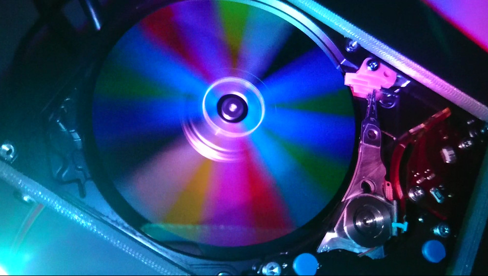
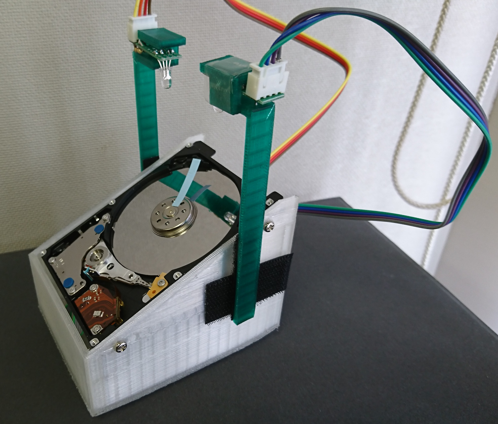
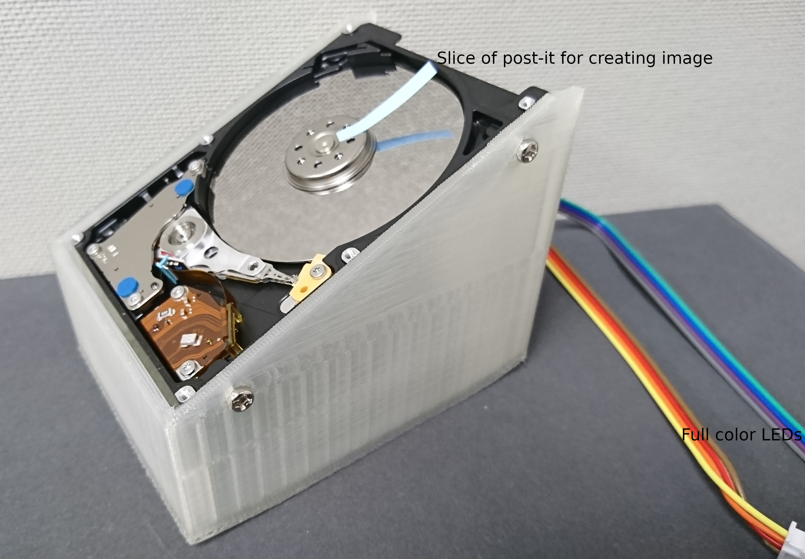
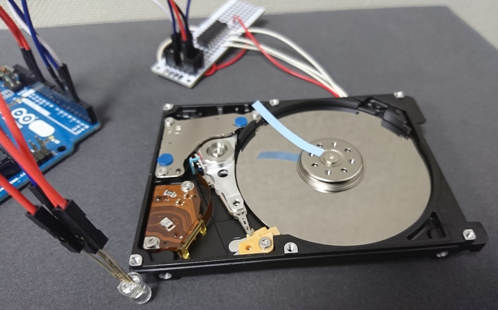

# HDDRotation - illumination utilizing HDD rotation.

## Overview

## Operating principle

The light from the LEDs illuminates the strip of post-it.
The rotation of the strip and the light from the LEDs are synchronized.
In other words, the color of the LEDs varies depending on the position of the strip.
Stable images are observed due to the characteristics of the human eye.

## Hardware

### Parts

* 2.5-inch HDD
* Arduino Uno
* Transistor Array 2003A (such as TD62003APG(Toshiba), ULN2003AN(TI))
* Full color LEDs
* Some resistors
* Case printed out with a 3D printer

### Schematic 

 

### Case

